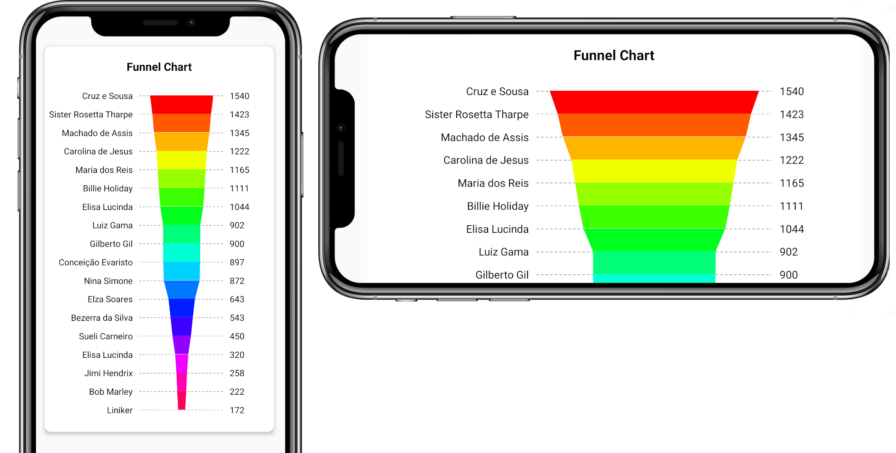

# react-native-funnel-chart

Customizable funnel chart component for React Native.



## Installation

1. Install library
  
  ```sh
  npm install react-native-funnel-chart --save
  ```

2. Install [react-native-svg](https://www.npmjs.com/package/react-native-svg) (dependency)

  ```sh
  npm install react-native-svg --save
  ```

3. Link native code
 
  &nbsp;&nbsp;&nbsp;See [react-native-svg](https://github.com/react-native-svg/react-native-svg#installation) documentation for more informations.

  &nbsp;&nbsp;&nbsp;With autolinking (react-native 0.60+)

  ```bash
  cd ios && pod install
  ```

  &nbsp;&nbsp;&nbsp;Pre 0.60

  ```bash
  react-native link react-native-svg
  ```

## Usage

[See full example](https://github.com/billlima/react-native-funnel-chart/blob/master/example/src/App.tsx).

```js
import FunnelChart from 'react-native-funnel-chart';

// ...
<FunnelChart
  data={[
    { text: 'Sueli Carneiro', value: 450 },
    { text: 'Elisa Lucinda', value: 320 },
    { text: 'Cruz e Sousa', value: 1540 },
    { text: 'Conceição Evaristo', value: 897 },
    { text: 'Elisa Lucinda', value: 1044 },
    { text: 'Luiz Gama', value: 902 },
    { text: 'Carolina de Jesus', value: 1222 },
    { text: 'Machado de Assis', value: 1345 },
    { text: 'Maria dos Reis', value: 1111 },
  ]}
/>
// ...
```

## Properties

The "data" property is the only one required.

| **Property**           | **Default** | **Type**                   | **Description**                                |
|--------------------|---------|------------------------|------------------------------------------------------------|
| data               |         | [DataObject](#dataobject)[]          | Data for the chart, see example.               |
| colors?             |         | string[]               | RGB or Hex colors, e.g.: ['rgb(111,111,111)', '#abaddd']. |
| sort?               | true    | boolean                | If true, data are sorted in descending order.             |
| itemHeight?         | 30      | number                 | Height of chart items.                                    |
| width?              |         | number                 | Width of chart.                                           |
| labelStyle?         |         | any                    | Style of labels (like Stylesheet).                        |
| valueStyle?         |         | any                    | Style of values (like Stylesheet).                        |
| labelNumberOfLines? | 1       | number                 | Max number of lines on each labels.                       |
| labelsFlex?         | 2       | number                 | Flex value of labels.                                     |
| valuesFlex?         | 1       | number                 | Flex value of values container.                           |
| formatValueLabel?   |         | function(item) => any  | This function change the format of the display values.    |
| onTextPress?        |         | function(item) => void | callback function when label is pressed.                  |


### DataObject

| Property | Default | Type   | Description                 |
|----------|---------|--------|-----------------------------|
| value    |         | number | Value of item.              |
| text     |         | string | Label of item.              |
| color?   |         | string | Color of item.              |


## Contributing

See the [contributing guide](CONTRIBUTING.md) to learn how to contribute to the repository and the development workflow.

## License

MIT
